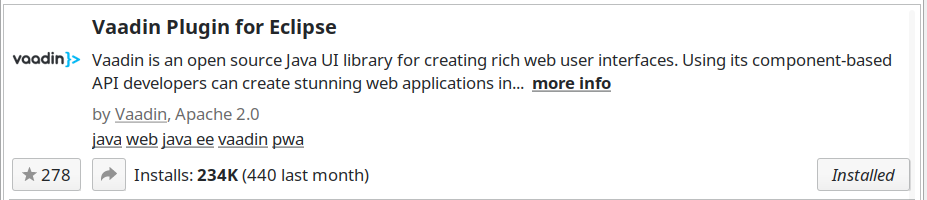

## Available UIs

* http://localhost:8080/app/concept
* http://localhost:8080/app/distribution
* http://localhost:8080/app/account
* http://localhost:8080/app/registration

## Developer

### Eclipse IDE

It is recommended to use the [Spring Tool Suite](https://spring.io/tools).

Make sure you have the **Maven2Eclipse** plugin installed.

In addition you will need the **Vaadin Eclipse Plugin** which can be installed via the Marketplace:

For working the the UI designs it is recommendet to install the Vaddin Designer for Vaadin 7.

### Configure vaadin UIs for a specific cdm data source

On the fist application startup on a cdm data source the `eu.etaxonomy.cdm.addon.config.CdmVaadinConfiguration` will create a `vaadin-apps.properties` file in the cdm source specific configuration folder: `~/.cdmLibrary/remote-webapp/${cdm-source-bean-id}/`

The default content of this file defined in `eu.etaxonomy.cdm.addon.config.CdmVaadinConfiguration.APP_FILE_CONTENT` at the time of writing this documentation is :

~~~
################################################################
#                                                               
# Vaadin application specific configurations                    
#                                                               
################################################################
                                                                
# Enablement of vaadin uis.                                     
#                                                               
# Multiple uis can be defined as comma separated list.          
# Whitespace before and after the comma will be ignored.        
# Valid values are the path properties of the @SpringUI         
# annotation which is used for UI classes.                      
cdm-vaadin.ui.activated=account,concept,distribution,editstatus 
~~~

There are more UIs that can be activated by adding them to the `cdm-vaadin.ui.activated` property. 
For example to enable the `RegistrationUI` you will need to add the name defined in `eu.etaxonomy.cdm.vaadin.ui.RegistrationUI.NAME`:

~~~
cdm-vaadin.ui.activated=account,concept,distribution,editstatus,registration 
~~~

### Auto login into the vaadin application

For development it can be convenient to enable the automatic login. 
To enable this feature you will need to supply the following system properties:

~~~
-Dcdm-vaadin.login.usr=username      
-Dcdm-vaadin.login.pwd=password
~~~

#### Setup Selenium based UI tests 

**NOTE**: 

* Run a `clean install` goal to download the Selenium drivers